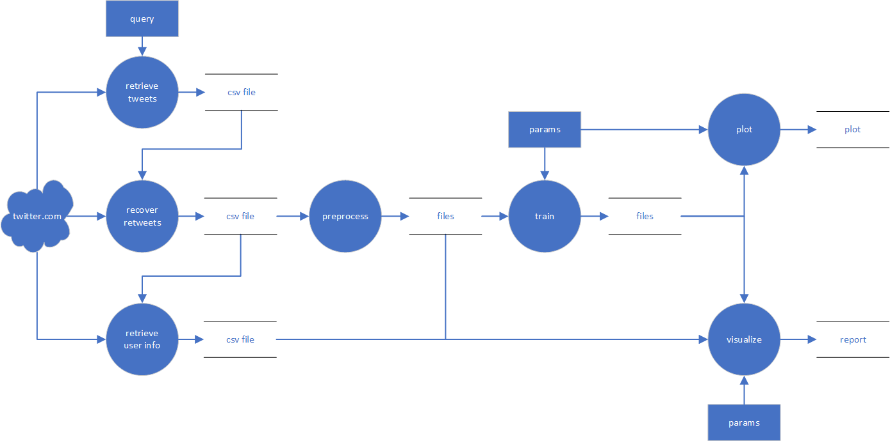

# topic-model-analysis

This is my summer intern project in Microsoft in year 2018. The system can automatically retrieve tweets regarding specific keywords from Twitter, train an LDA topic model to cluster topics from tweets, and present a visual and interactive interpretation of the result.

The data pipeline is as follows:

